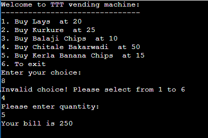

# C-Problems-and-Practice
Just my collection of C# programs to learn the basics.

# Code vending.cs
Written by: Rajat Pawan Tarade

Date: 27 Sept 2022

Discription: In this program, I have implemented a Vending Machine.
 The program starts with displaying the full range of products available saved in an array
 printing them one by one using a 'for' loop. Then it asks the user to choose a product.
 Then the program is frozen using a 'while' loop untill a valid input is received, that is,
 an input between the range of 1 to 6. Once a valid input is received it asks for the quantity 
 and calculates the total bill.

 This code uses following basic concepts 

* User Input
* Formatted Output
* String and Integer Array
* 'For' and 'While' loop
* Branching statements (if, else)
* Products as Objects with methods (OOP)
* Ability to ADD and REMOVE a product
 
 To be implemented:
 * ~Products as Objects with methods (OOP)~
 * ~Ability to ADD and REMOVE a product~
 
# Sample Output

